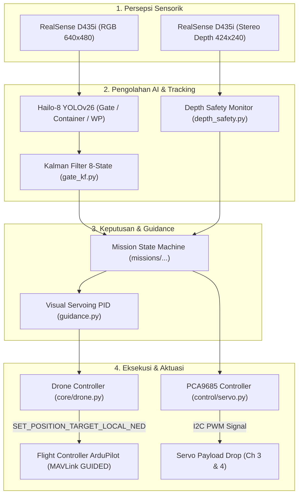
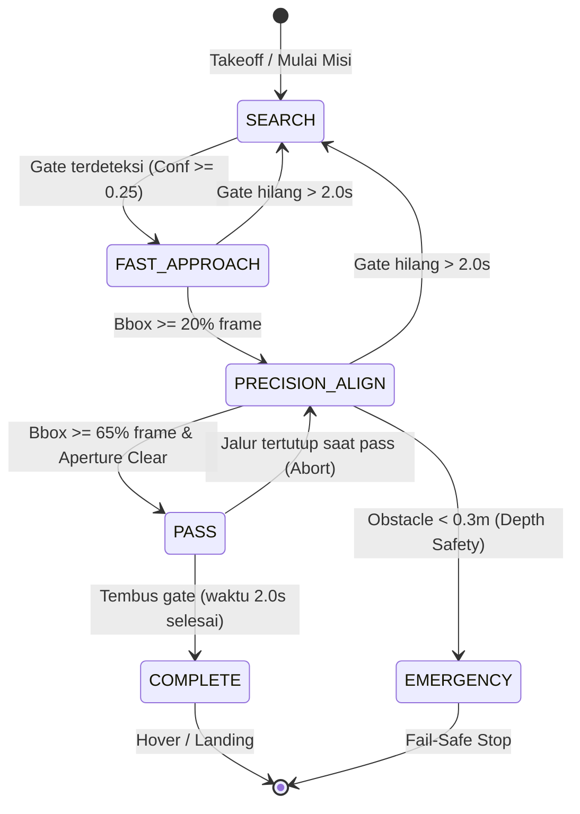
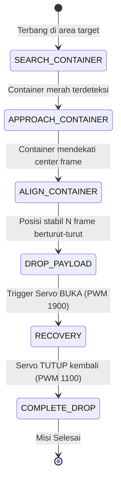
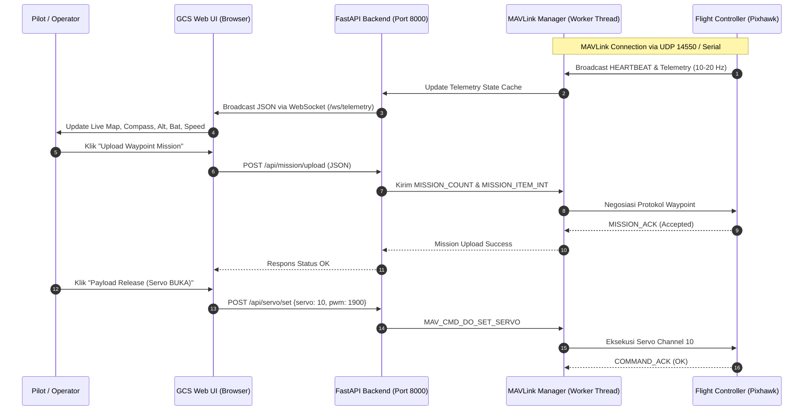

# GCS & Sistem Wahana Otonom VTOL — KRTI 2026 (Kingphoenix)

Repository resmi sistem komputasi on-board (*companion computer*), kendali otonom berbasis kecerdasan buatan (*AI visual servoing*), aktuasi payload, dan **Ground Control Station (GCS)** untuk wahana VTOL tim Kingphoenix pada **Kontes Robot Terbang Indonesia (KRTI) 2026**.

---

## 📑 Daftar Isi
1. [Arsitektur & Spesifikasi Sistem](#-arsitektur--spesifikasi-sistem)
2. [Alur Kerja Program (Program Flow)](#-alur-kerja-program-program-flow)
   - [Alur Sistem Keseluruhan](#1-alur-sistem-keseluruhan)
   - [State Machine Misi Otonom](#2-state-machine-misi-otonom)
   - [Alur Komunikasi GCS (Ground Control Station)](#3-alur-komunikasi-gcs)
3. [Struktur Direktori Proyek](#-struktur-direktori-proyek)
4. [Instalasi & Persiapan Lingkungan](#-instalasi--persiapan-lingkungan)
5. [Panduan Menjalankan Sistem (Step-by-Step)](#-panduan-menjalankan-sistem-step-by-step)
   - [A. Menjalankan Ground Control Station (GCS)](#a-menjalankan-ground-control-station-gcs)
   - [B. Menjalankan MAVProxy & Telemetri Pi](#b-menjalankan-mavproxy--telemetri-pi)
   - [C. Menjalankan Camera Streaming](#c-menjalankan-camera-streaming)
   - [D. Diagnostik & Pengujian Servo](#d-diagnostik--pengujian-servo)
   - [E. Menjalankan Misi Otonom](#e-menjalankan-misi-otonom)
6. [Fitur & Penggunaan Web GCS](#-fitur--penggunaan-web-gcs)
7. [Kalibrasi & Tuning](#-kalibrasi--tuning)
8. [Protokol Keamanan & Fail-Safe](#-protokol-keamanan--fail-safe)

---

## 🛸 Arsitektur & Spesifikasi Sistem

| Komponen | Spesifikasi & Hardware | Peran / Fungsi |
|---|---|---|
| **Companion Computer** | Raspberry Pi 5 (8GB RAM, OS 64-bit) | Pusat pemrosesan algoritma misi, fusi sensor, & GCS link |
| **AI Accelerator** | Hailo-8 M.2 (26 TOPS) | Inferensi neural network YOLOv26 real-time (30–60 FPS) |
| **Vision & Depth Sensor** | Intel RealSense D435i | Input visual RGB + Stereo Depth (Deteksi jarak & Anti-Kolusi) |
| **Flight Controller** | Pixhawk / ArduPilot via UART (`/dev/ttyAMA0`, 921600 baud) | Siklus kendali attitude, posisi, motor, & safety ELS |
| **Payload Actuator** | Modul PCA9685 I2C (16-Channel 12-bit PWM) | Kontrol servo pelepas First Aid Kit (Channel 3 & 4) |
| **GCS Backend** | Python FastAPI + Uvicorn + Pymavlink | Manajemen MAVLink UDP, WebSocket telemetry stream, REST API |
| **GCS Frontend** | HTML5, CSS3, Vanilla JS, Leaflet Map | Antarmuka peta, visualisasi telemetri, pembuatan misi waypoint |

---

## 🔄 Alur Kerja Program (Program Flow)

### 1. Alur Sistem Keseluruhan



---

### 2. State Machine Misi Otonom

#### A. Misi Gate Passing (`missions/gate_mission.py`):


#### B. Misi Container Drop (`missions/container_mission.py`):


---

### 3. Alur Komunikasi GCS



---

## 📁 Struktur Direktori Proyek

```text
GCS-KRTI2026/
├── config.py                 # Konfigurasi sentral (parameter kamera, PID, MAVLink, servo, safety)
├── camera_calibration.json   # Parameter intrinsik & distorsi RealSense D435i
├── servo_diag.py             # Script diagnostik hardware PCA9685 I2C
├── launch_mission.sh         # Launcher otomatis eksekusi misi
├── README.md                 # Dokumentasi sistem & panduan operasional
│
├── core/                     # Modul logika inti (Core AI & Perception)
│   ├── camera.py             # RealSense RGB-D capture pipeline & loader kalibrasi
│   ├── depth_safety.py       # Anti-collision monitor stereo depth D435i
│   ├── drone.py              # Wrapper MAVLink ArduPilot (GUIDED velocity & nav)
│   ├── fusion.py             # Fusi data YOLO bbox + depth map
│   ├── gate_kf.py            # Kalman Filter 8-state estimasi pergerakan objek
│   ├── guidance.py           # Kontroler visual servoing PID
│   ├── hailo_detector.py     # Wrapper inferensi YOLO pada Hailo-8
│   ├── tracker.py            # IoU bounding box tracking & smoothing
│   └── vision_utils.py       # Drawing HUD, ArUco 6DOF pose estimation
│
├── control/                  # Aktuasi & Kendali Servo
│   ├── servo.py              # Driver direct PCA9685 (buka, tutup, lepas)
│   ├── mavlink_servo.py      # Listener MAVLink DO_SET_SERVO / SERVO_OUTPUT_RAW
│   └── mavlink_toggle_servo.py # Listener MAVLink DO_SET_RELAY & DO_SET_SERVO
│
├── missions/                 # Implementasi Misi Otonom
│   ├── gate_mission.py       # Misi Gate Passing otonom
│   ├── container_mission.py  # Misi First Aid Kit Drop otonom
│   └── waypoint_engine.py    # Mesin navigasi Waypoint visual & ArUco
│
├── tools/                    # Alat Bantu & Kalibrasi
│   ├── bbox_calibration.py   # GUI kalibrasi center offset bounding box
│   ├── depth_viewer.py       # Visualizer stereo depth map
│   └── hailo_live.py         # Live view pengujian model Hailo-8
│
├── backend/                  # Backend Ground Control Station
│   ├── main.py               # FastAPI server (Endpoints, WebSocket, Static Router)
│   ├── mavlink_manager.py    # Thread-safe MAVLink manager & telemetry parser
│   └── requirements.txt      # Daftar dependensi Python backend
│
├── frontend/                 # Web Interface GCS
│   ├── index.html            # Antarmuka web (Map Leaflet, HUD, Mission Builder)
│   ├── app.js                # State management, WebSocket parser, Map rendering
│   ├── style.css             # Desain UI modern & responsif
│   └── vendor/               # Asset offline Leaflet JS/CSS
│
├── pi/                       # Skrip Service Raspberry Pi
│   ├── camera_server.py      # MJPEG video streaming server
│   ├── detector.py           # Hailo-8 detection overlay untuk streaming video
│   ├── pca_servo.py          # Modul MAVProxy kontrol servo PCA9685
│   ├── start_cameras.sh      # Bash script peluncuran camera stream
│   └── start_mavproxy.sh     # Bash script peluncuran MAVProxy routing
│
├── model/                    # File Model Neural Network (HEF Format)
│   ├── 320px-v1.hef          # Model input 320x320
│   ├── 640px-v1.hef          # Model input 640x640
│   ├── KP2026V1-YOLOv26.hef  # YOLOv26 versi 1
│   └── KP2026V2-YOLO26.hef   # YOLOv26 versi 2
│
└── docs/                     # Dokumen Regulasi & Desain Teknis
    ├── ARCHITECTURE.md       # Arsitektur detail sistem
    ├── RULES.md              # Ringkasan aturan resmi KRTI 2026
    ├── STRATEGY.md           # Analisis strategi kontes
    ├── ROADMAP.md            # Roadmap pengembangan tim
    ├── GCS_STRATEGY.md       # Desain arsitektur telemetri GCS
    └── Panduan-KRTI-2026l.pdf # Panduan lomba resmi
```

---

## 🛠️ Instalasi & Persiapan Lingkungan

### 1. Kebutuhan Sistem
- Raspberry Pi 5 dengan Raspberry Pi OS 64-bit (Bookworm/Debian).
- Hailo-8 M.2 AI Module terpasang dengan driver `hailort` aktif.
- Antarmuka I2C dan UART aktif di `/boot/firmware/config.txt`.

### 2. Instalasi Dependensi Python
Jalankan perintah berikut di terminal:
```bash
# Update sistem
sudo apt update && sudo apt install -y python3-pip python3-opencv i2c-tools

# Masuk ke direktori proyek
cd /home/kingphoenix/KRTI2026-WP

# Install dependensi Python
pip3 install -r backend/requirements.txt
pip3 install adafruit-circuitpython-pca9685 adafruit-circuitpython-motor pyrealsense2
```

---

## 🚀 Panduan Menjalankan Sistem (Step-by-Step)

### A. Menjalankan Ground Control Station (GCS)
Backend GCS bertindak sebagai jembatan antara MAVLink dengan tampilan Web UI.

```bash
# 1. Jalankan FastAPI server (berjalan di port 8000)
uvicorn backend.main:app --host 0.0.0.0 --port 8000
```
> **Akses Browser**: Buka browser di laptop/komputer GCS dan buka `http://<IP-Raspberry-Pi>:8000` (atau `http://localhost:8000` jika langsung dari Pi).

---

### B. Menjalankan MAVProxy & Telemetri Pi
Jika menghubungkan Pi ke Flight Controller lewat port serial hardware:
```bash
# Jalankan script MAVProxy (meneruskan serial /dev/ttyAMA0 ke UDP 14550 GCS)
bash pi/start_mavproxy.sh
```
Atau jika ingin menjalankan servo listener langsung:
```bash
python3 control/mavlink_toggle_servo.py --port /dev/ttyAMA0 --baud 921600
```

---

### C. Menjalankan Camera Streaming
Untuk menyiarkan feed video RealSense dengan overlay deteksi AI Hailo-8 ke Web GCS:
```bash
# Menjalankan MJPEG camera server pada port 8080
bash pi/start_cameras.sh
```

---

### D. Diagnostik & Pengujian Servo
Lakukan pengujian servo sebelum wahana lepas landas untuk memastikan fungsi mekanik:

```bash
# 1. Scan bus I2C untuk memastikan chip PCA9685 terdeteksi (alamat 0x40)
python3 servo_diag.py --scan

# 2. Uji sweep servo (0° -> 180° -> 0°) untuk melihat pergerakan halus
python3 servo_diag.py --sweep --both

# 3. Mode interaktif keyboard (o = buka, c = tutup, q = keluar)
python3 control/servo.py
```

---

### E. Menjalankan Misi Otonom

#### 1. Misi Gate Passing (Misi 3):
```bash
# Menggunakan launcher otomatis
./launch_mission.sh --gates 1 --alt 1.4

# Atau menjalankan script langsung:
python3 missions/gate_mission.py --hef model/320px-v1.hef --port /dev/ttyAMA0 --alt 1.4
```

#### 2. Misi Payload Drop (First Aid Kit) (Misi 2):
```bash
python3 missions/container_mission.py --hef model/320px-v1.hef --conf 0.35
```

#### 3. Mode Simulasi / Dry-Run (Uji Meja di Laboratorium):
Untuk menguji pipeline deteksi dan logika tanpa perlu koneksi ke wahana/hardware:
```bash
# Uji Gate Mission dalam mode vision-only
python3 missions/gate_mission.py --vision-only

# Uji Servo Controller dalam mode simulasi
python3 control/servo.py --dry-run
```

---

## 🖥️ Fitur & Penggunaan Web GCS

Ground Control Station (GCS) berbasis web menyediakan fitur lengkap:

1. **Live Peta Interaktif (Leaflet Map)**:
   - Menampilkan posisi real-time drone, titik Home, dan jalur pergerakan (*flight track*).
   - Fitur klik untuk menambah Waypoint, jalur misi, dan titik drop.
   - Pilihan base map offline/online dengan caching otomatis.

2. **Instrumentasi & Telemetri HUD**:
   - Status mode terbang (GUIDED, AUTO, STABILIZE, RTL, LAND).
   - Indikator Armed / Disarmed, Voltase Baterai, Ketinggian (Relatif & MSL), Kecepatan Udara/Darat, dan Heading Kompas.

3. **Mission Planner & Sequencer**:
   - Membuat urutan waypoint: `TAKEOFF` $\rightarrow$ `WAYPOINT` $\rightarrow$ `SERVO (Drop)` $\rightarrow$ `DELAY` $\rightarrow$ `LAND`.
   - Upload & Download misi langsung ke Flight Controller via protokol MAVLink WPL/Microservices.

4. **Kontrol Cepat & Override**:
   - Tombol Arm/Disarm, Takeoff otomatis ke ketinggian tertentu.
   - Tombol manual trigger Payload Release (Buka / Tutup servo).
   - Tombol Change Flight Mode instan.

---

## 🎯 Kalibrasi & Tuning

### 1. Kalibrasi Offset Bounding Box
Jika bounding box deteksi tidak persis berada di tengah fisik objek:
```bash
python3 tools/bbox_calibration.py --hef model/320px-v1.hef
```
- Gunakan tombol **Panah** untuk menggeser offset piksel center.
- Tekan **Tab** untuk berganti kelas (`Container`, `Gate`, `Waypoint`).
- Tekan **s** untuk menyimpan hasil ke [`config/bbox_calibration.json`](file:///home/kingphoenix/KRTI2026-WP/config/bbox_calibration.json).

### 2. Parameter Terbang di `config.py`
Buka file [`config.py`](file:///home/kingphoenix/KRTI2026-WP/config.py) untuk mengatur parameter kunci:
- `CRUISE_SPEED_MIN` & `CRUISE_SPEED_MAX`: Kecepatan maju saat approach gate.
- `KP_X_FAST`, `KI_X_FAST`, `KD_X_FAST`: Parameter PID koreksi lateral (kiri-kanan).
- `DEPTH_MIN_CLEARANCE_M`: Batas jarak obstacle aman dari RealSense stereo depth.
- `PWM_BUKA` (1900) & `PWM_TUTUP` (1100): Lebar pulsa mikrodetik servo.

---

## 🛡️ Protokol Keamanan & Fail-Safe

1. **Anti-Collision Stereo Depth**: Modul `depth_safety.py` membaca depth map RealSense secara asinkron. Bila ada obstacle berjarak $< 0.3\,\text{m}$ di depan wahana, sistem seketika memicu status **EMERGENCY** (hover/stop maju).
2. **Detection Timeout**: Jika objek target hilang lebih dari $2.0\,\text{detik}$, wahana membatalkan akselerasi dan masuk ke mode pencarian (*SEARCH*) atau hover.
3. **Heartbeat Loss Protection**: Jika komunikasi MAVLink dengan Flight Controller terputus $> 5.0\,\text{detik}$, sinyal PWM servo otomatis dilepas (`duty_cycle = 0`) untuk mencegah kerusakan motor servo akibat *stall*.
4. **Manual RC Override**: Pilot manusia memegang kendali prioritas tertinggi melalui transmitter RC. Mode switch ke Manual/Stabilize/RTL pada remote akan langsung membatalkan perintah companion computer.
